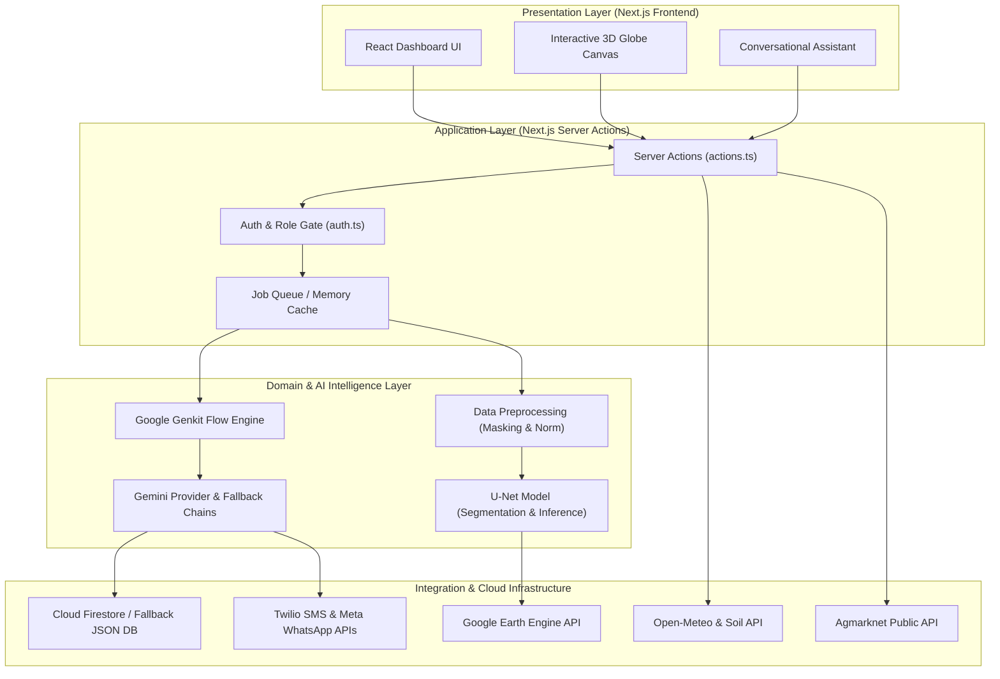
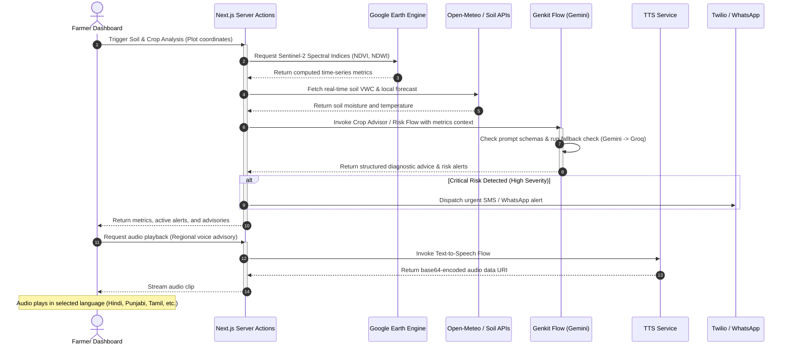
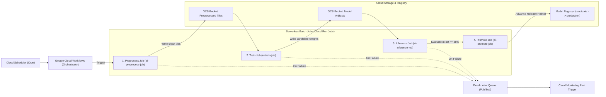

# Kisan Alert - Smart Farmer Advisory and Satellite Monitoring Portal

Kisan Alert is a production-grade, farmer-first agricultural portal designed to provide real-time soil diagnostics, automated meteorological alerts, and AI-powered crop leaf disease pathology. Powered by the high-performance **Earth Insights** satellite engine, Kisan Alert bridges the gap between complex geospatial data and actionable agricultural advice.

---

## 🌾 Core Capabilities

1. **Interactive 3D Satellite Plot Tracker:** Registers farmer land plots using latitude/longitude and visualizes them as pulsing markers on a mouse-interactive 3D globe reflecting active alert severity ([kisan-globe-3d.tsx](file:///D:/google%20code%20hackathon/Karshakar/src/components/kisan-globe-3d.tsx)).
2. **Automatic Meteorological & Soil Alerts:** Runs evaluations on a 4-hour schedule comparing local crop plots with live sensor records from the Open-Meteo and Soil APIs. Immediately fires alerts for dryness, waterlogging saturation, heatwaves, frost hazards, and flooding risks ([alert-engine.ts](file:///D:/google%20code%20hackathon/Karshakar/src/lib/alert-engine.ts)).
3. **AI Crop Leaf Pathology Scanner:** Uploads photographs of plant leaves to identify pests, diseases, or nutritional deficiencies using **Gemini Vision** (with local mock fallbacks) and provides organic & chemical control remedies ([detect-pest-disease.ts](file:///D:/google%20code%20hackathon/Karshakar/src/ai/flows/detect-pest-disease.ts)).
4. **Text-to-Speech (TTS) Voice Advisories:** Supports low-literacy users and improves accessibility by reading out active alert warnings and diagnostics in their preferred regional languages ([text-to-speech.ts](file:///D:/google%20code%20hackathon/Karshakar/src/ai/flows/text-to-speech.ts)).
5. **Mandi Rates Market Ticker:** Connects to the **data.gov.in Agmarknet API** to surface live regional commodity trading ranges (Wheat, Rice, Cotton, Tomato, Potato, Onion, etc.) per quintal.

---

## 📊 System Architecture & Data Flows

### 1. High-Level System Architecture
The application follows a modular, layered architecture pattern mapping presentation, app logic, core domain intelligence, and serverless operations:



---

### 2. Interactive Advisory Request Flow
This diagram details the sequence triggered when a farmer checks a plot or uploads a crop leaf image:



---

### 3. Serverless Preprocessing & MLOps Batch Pipeline (Phase 3 Backend)
For large-scale dataset generation, model training, validation, and automated promotion:



---

## 🛠️ Technology Stack

*   **Application Framework:** Next.js 15 (using App Router, Server Actions, React 18, and TypeScript)
*   **Styling & UI:** Tailwind CSS, Radix UI Primitives, Recharts (for charts), Lucide React (icons)
*   **AI Orchestration:** Google Genkit + Google Gemini (with Groq, Mistral, and HuggingFace API fallback chains)
*   **Database:** Firestore (Firebase Admin SDK) with a local JSON file-based database fallback (`kisan-alert-db.json`)
*   **Orchestration Backend:** GCP Cloud Run, Pub/Sub, Cloud Workflows, Cloud Logging/Monitoring
*   **Testing & Quality:** Vitest (unit/integration tests), Playwright (E2E tests), ESLint (linting), Prettier (formatting)

---

## 🚀 Getting Started

### Prerequisites
*   Node.js (version `>=24.11.1 <25` specified in `.nvmrc`)
*   npm (pre-packaged with Node)

### 1. Installation
Clone the repository and install all dependencies:
```bash
npm install
```

### 2. Environment Configuration
Copy `.env.example` to create your local environment variables:
```bash
cp .env.example .env
```

> [!IMPORTANT]
> The application will look for `GOOGLE_APPLICATION_CREDENTIALS_JSON` inside `.env`. 
> If this environment variable is missing, the system will **automatically run in local sandbox mode**, using a local file database ([kisan-alert-db.json](file:///D:/google%20code%20hackathon/Karshakar/kisan-alert-db.json)) and mocked AI provider fallbacks. This allows local front-end debugging without needing cloud keys.

Fill out the variables inside `.env`:
*   `GEMINI_API_KEY` / `GOOGLE_GENAI_API_KEY`: Primary Gemini API keys for AI advisor diagnostics.
*   `GROQ_API_KEY` / `MISTRAL_API_KEY` / `HUGGINGFACE_API_KEY`: Fallback API keys to prevent downtime.
*   `GOOGLE_APPLICATION_CREDENTIALS_JSON`: Single-line JSON string representing GCP credentials.
*   `TWILIO_ACCOUNT_SID` / `TWILIO_AUTH_TOKEN` / `TWILIO_FROM_NUMBER` / `WHATSAPP_PHONE_NUMBER_ID` / `WHATSAPP_ACCESS_TOKEN`: Twilio SMS and WhatsApp endpoints for active alerts.
*   `CRON_SECRET`: Access key to protect the `/api/cron/run-alerts` alert scheduling route.
*   `DATA_GOV_IN_API_KEY`: Key to retrieve live Agmarknet mandi rates.

### 3. Local Development Run
Start the Next.js local development server (runs on port `9003` by default):
```bash
npm run dev
```

Start the Google Genkit UI console for testing prompts and flows:
```bash
npm run genkit:dev
```

---

## 🧪 Testing & Verification

The codebase includes a comprehensive suite of unit tests, contract validations, and formatting checks. Run them before proposing changes:

```bash
# Run unit & integration tests (Vitest)
npm run test

# Run ESLint check
npm run lint

# Run ESLint automatic fixing
npm run lint:fix

# Run TypeScript typechecks
npm run typecheck

# Run Playwright E2E browser tests
npm run test:e2e
```

> [!TIP]
> Tests are configured to automatically bypass external AI API calls if keys are absent, logging warnings and exiting cleanly rather than failing mock checks.

---

## ☁️ Production Deployment

### 1. Frontend & Portal
The Next.js portal is configured to be hosted on **Firebase App Hosting** or **Vercel** with Next.js Server Actions handling database writes.
To build the application bundle locally:
```bash
npm run build
```

### 2. GCP Serverless Pipelines (Phase 3 Backend)
The backend pipeline for geospatial preprocessing and ML training is defined under `infra/gcp/`.
To execute simulations or trigger manual stages:
```bash
# Run local simulation of the GCP pipeline
npm run gcp:phase3

# Execute benchmark data pipeline tiling tests
npm run pipeline:benchmark

# Execute ML training loop simulation tests
npm run ml:phase2:test
```

Production serverless definitions are structured as follows:
*   **Workflows:** [infra/gcp/workflows/batch-orchestrator.yaml](file:///D:/google%20code%20hackathon/Karshakar/infra/gcp/workflows/batch-orchestrator.yaml) handles stage execution.
*   **Budgets:** [infra/gcp/budgets/budget.json](file:///D:/google%20code%20hackathon/Karshakar/infra/gcp/budgets/budget.json) handles cost guardrails.
*   **Monitoring:** [infra/gcp/monitoring/alerts.json](file:///D:/google%20code%20hackathon/Karshakar/infra/gcp/monitoring/alerts.json) sets up SLO notifications.
